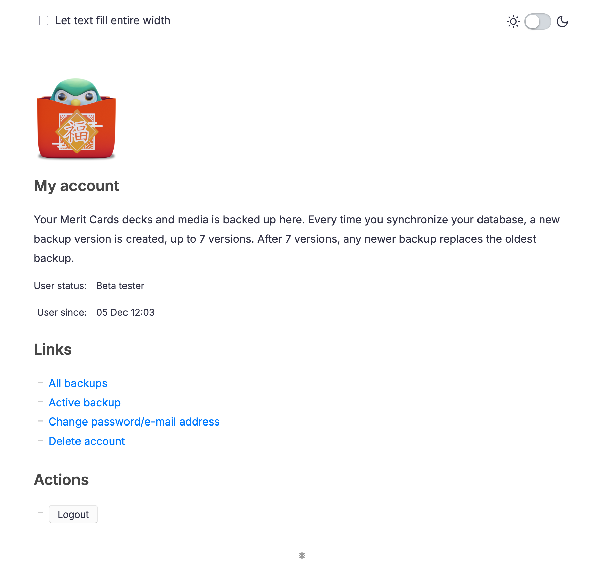

# Merit Cards Sync

This is Merit Cards’ open-source sync backend. It receives and stores user backups which can be synchronized by [Merit Cards](https://meritcards.app) for Windows and Android.

You can use also set up your own instance: [Installation/setup](#installationsetup)



## Architecture/settings

Merit Cards Sync is a basic Rails application. It primarily uses ActiveStorage to store _Archives_ which are attached to _Users_.

* `config/storage.yml`
* `app/models/archive.rb`
* `app/models/user.rb`

By default, a user can have up to 7 backups. The maximum file size should be configured in the reverse proxy (if applicable). The maximum storage for users is set to 1 GB, after which the server responds with `413`.

* `config/application.rb`
* `app/controllers/archives_controller.rb`

User and other data is stored in a local SQLite database.

* `config/database.yml`

When running your own instance, you need to edit the allowed hosts:

* `config/environments/production.rb`

### A note on encryption

Merit Cards Sync itself doesn't encrypt user backups. I don't want this because I don't want the server to receive any unencrypted user data.

Merit Cards for Windows and Android themselves take care of sending encrypted files. The server only provides one part of a _key_ that is used to encrypt the backup. The other part of the key is your user's password.

The server stores your user password hashed, so it already has no knowledge of your real password. In the client applications, you need to log into your account once to construct this individual key (which is stored locally).

A backup can only be decrypted with this unique key.

## Installation/setup

```shell
bundle install
bundle exec rails db:migrate
```

Create a user in Rails' console: `bundle exec rails c`

```ruby
User.create! email: "my@example.org", password: "password"
```

This creates a unique token which must be used to authenticate this user in a REST client.

**Note:** Make sure to set `RAILS_ENV=production` or use `-e production` for production environments.

## Endpoints

Merit Cards Sync is a _REST_ API. To learn what features are available, you should use a REST client and parse its hypermedia responses. For example, if you query the index page, you get a list of links:

```html
<ul class="links">
	<li><a href="/login" data-login-url="/login">Authorization token</a></li>
	<li><a href="/my" data-account-url="/my">My account</a></li>
	<li><a href="/my/archives" data-backup-url="/my/archives">All backups</a></li>
	<li><a href="/my/archives/latest" data-latest-backup-url="/my/archives/latest">Active backup</a></li>
	<li><a href="/my/archives/latest/download" data-download-latest-backup-url="/my/archives/latest/download">Download active backup</a></li>
</ul>
```

When not using Merit Cards Sync's web interface, a REST client should do:

1. Query the index page using HTTP basic authentication.
2. Look for the location to get the _Authorization token_ (`data-login-url`)
3. POST a request to this location (basic authenticated). This returns a unique user token.
4. Store the token, and make any other request using this _Bearer_ token.

All endpoints return hypermedia. There are `.links` to other locations, and `.actions` to do.

In general, if there is a "web browser request", Merit Cards Sync returns styled HTML. For requests that are basic-authenticated or with a bearer token, only basic hypermedia is returned.

## License

```
Copyright (C) 2024-2025 Eroica

This software is provided 'as-is', without any express or implied
warranty. In no event will the authors be held liable for any damages
arising from the use of this software.

Permission is granted to anyone to use this software for any purpose,
including commercial applications, and to alter it and redistribute it
freely, subject to the following restrictions:

1. The origin of this software must not be misrepresented; you must not
   claim that you wrote the original software. If you use this software
   in a product, an acknowledgment in the product documentation would be
   appreciated but is not required.
2. Altered source versions must be plainly marked as such, and must not be
   misrepresented as being the original software.
3. This notice may not be removed or altered from any source distribution.
```
